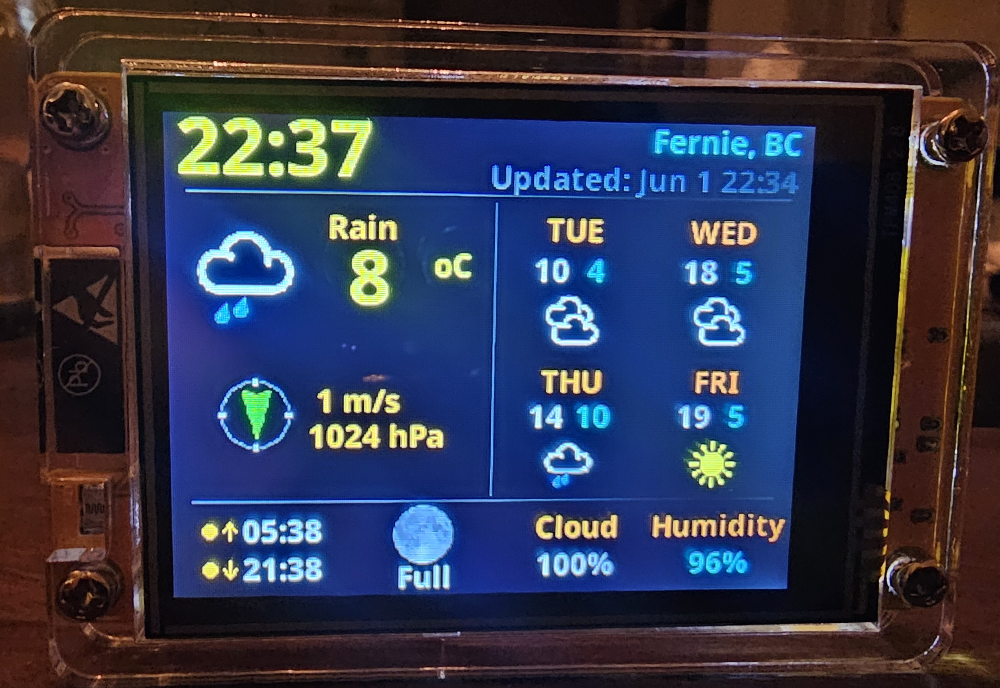

# ESP32 Cheap Yellow Display (CYD) Weather Station with 3 days Forecast

This project was converted from building with the Arduino IDE over to Platform.io by [@rprouse](https://github.com/rprouse), then redesigned the layout to landscape from the original portrait mode.

This is the accompanying repository for my article "Create an Internet Weather Station with 3 days Forecast on an ESP32 Cheap Yellow Display ("CYD")" available here: https://medium.com/@androidcrypto/create-an-internet-weather-station-with-3-days-forecast-on-an-esp32-cheap-yellow-display-cyd-15eb5c353b1d

For short - what is a "Cheap Yellow Display" ? This device was introduced some years ago and allowed for very fast development of projects where an ESP32, a TFT (optional Touch surface), an SD Card Reader and an RGB LED is required. The first version was equipped with a 2.8 inch large TFT display with **ILI9341** driver chip and **XPT2046** resistive Touch driver chip. Newer versions are sold with a **ST7789** display driver chip. Nowadays, the device is available with different display sizes (1.28 up to 7 inches) and driver chips, but I'm focusing on the 2.8 inch variants. The display has a size of **320 x 240** pixels in Landscape orientation. Most of the devices are driven by an ESP32 WROOM microcontroller, but I saw some others with an ESP32-S3 chip.



## Required Libraries

````plaintext
TFT_eSPI Version: 2.5.43) (https://github.com/Bodmer/TFT_eSPI)
OpenWeather Version: Feb 16, 2023 (https://github.com/Bodmer/OpenWeather)
JSON_Decoder Version: n.a. (https://github.com/Bodmer/JSON_Decoder)
TJpg_Decoder Version: 1.1.0 (https://github.com/Bodmer/TJpg_Decoder)
Timezone Version: 1.2.6 (https://github.com/JChristensen/Timezone)
````

These libraries are automatically downloaded and included by Platform.IO.

## This sketch uses the LittleFS file system

The weather icons and font files are stored in the LittleFS filesystem. Before running the sketch you need to upload the files in the sketch subfolder 'data' to the ESP32. To do this with Platform.IO, open the extension, then under **Platform**, first **Build Filesystem Image**, then **Upload Filesystem Image**.
